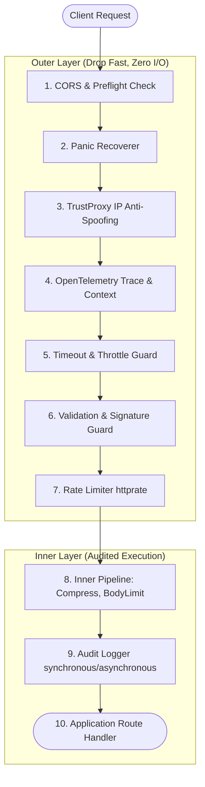
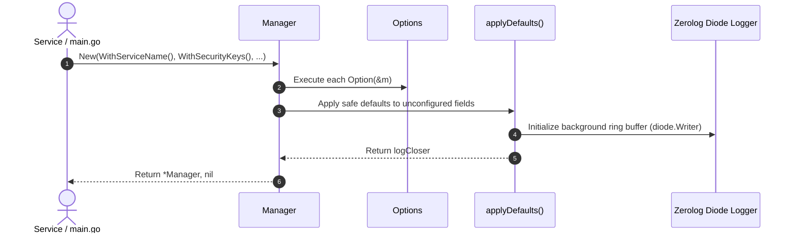
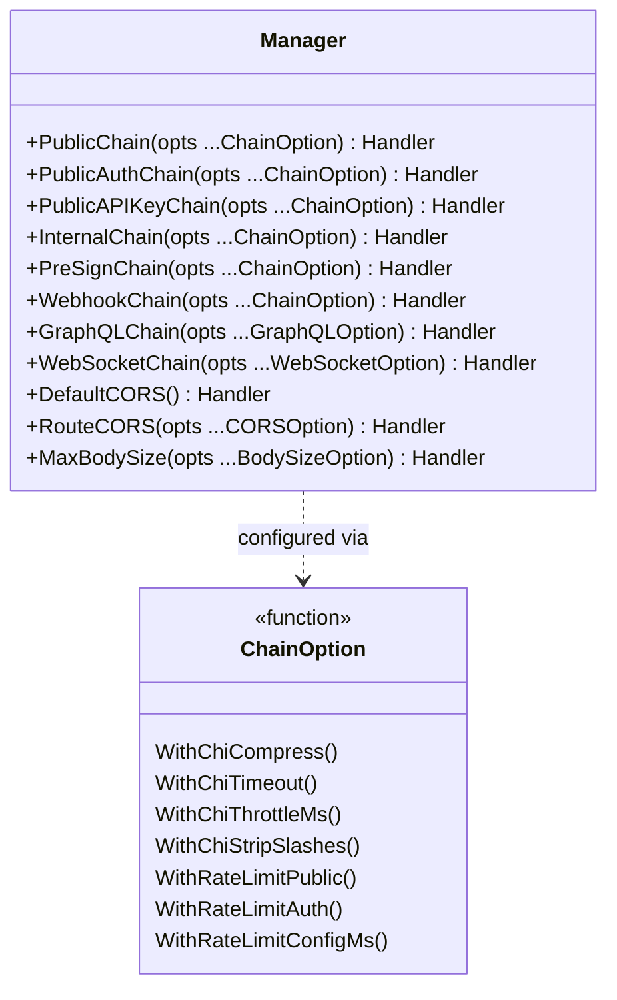
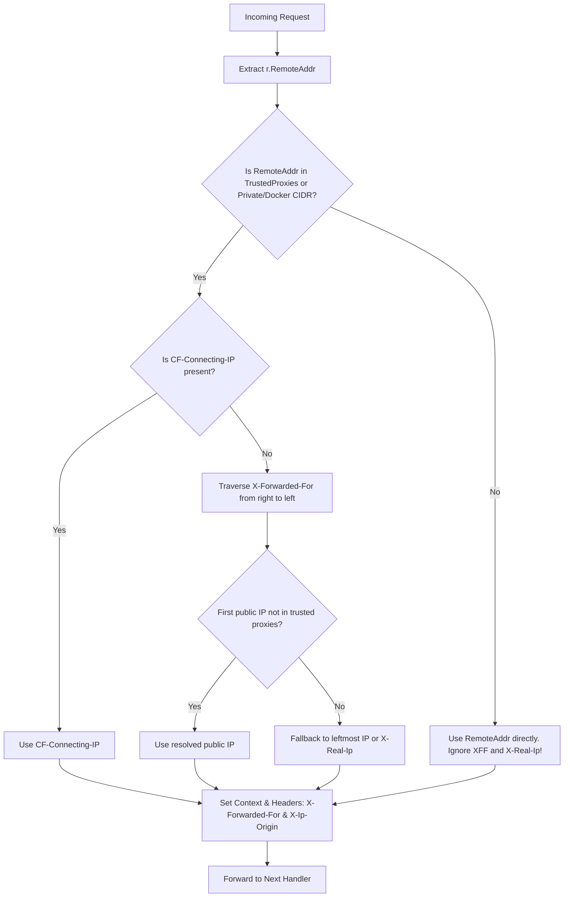

# NVX Go Middleware — Architecture & Technical Reference

This document provides a comprehensive technical overview of the internal architecture, request lifecycle, execution diagrams, and functional options configuration available in `nvx-go-middleware`.

---

## 1. High-Level Architecture

`nvx-go-middleware` adopts the **Functional Options Pattern** and a **Layered Pipeline Architecture**. Its core design philosophy is **DDoS & Bad Request Drop First**: invalid, unauthenticated, or rate-exceeded requests are terminated *before* reaching the audit logging store or application handlers, saving CPU cycles, memory, and database I/O.



---

## 2. Manager Initialization (`middleware.New`)

The `Manager` is initialized using the variadic function `New(opts ...Option) (*Manager, error)`.



### Complete Manager Options Reference (`Option`)

| Category | Option | Description |
|---|---|---|
| **Core** | `WithServiceName(name string)` | Sets service identifier for telemetry and structured logs. |
| | `WithEnv(env string)` | Runtime environment (`development`, `staging`, `production`). |
| | `WithTelemetry(enable bool)` | Enables or disables OpenTelemetry tracing & span injection. |
| | `WithCore(core ConfigCore)` | Configures the entire `ConfigCore` struct in a single call. |
| **Logging & Store** | `WithLogger(l Logger)` | Sets a custom logger implementation (slog, zap, logrus). |
| | `WithLogStore(s LogStore)` | Sets the audit storage backend (e.g. PostgreSQL, ClickHouse). |
| | `WithLogHeaders(headers ...string)` | HTTP headers to record in structured log events. |
| | `WithBodyLogging(req, resp bool)` | Toggles request and response body capture. |
| | `WithMaskKeywords(keywords ...string)` | Sensitive keywords to mask automatically (`*`). |
| | `WithResponseBodyLogLimit(size int64)` | Maximum bytes of response body captured in logs. |
| **Limits** | `WithRequestTimeoutMs(ms int64)` | Maximum request context deadline in milliseconds (default 60,000ms). |
| | `WithRequestBodyLimitSize(size int64)` | Overall maximum request body size (default 2GB for uploads). |
| | `WithRequestBodyNonFileLimitSize(size int64)` | Maximum non-multipart request body size (default 3MB). |
| **Security** | `WithSecurityKeys(pub, priv string)` | Public & Private HMAC keys for signature verification. |
| | `WithTrustedProxies(proxies ...string)` | Trusted proxy IPs/CIDRs (Cloudflare, AWS ALB, Docker network). |
| | `WithAllowedOrigins(origins ...string)` | Permitted origins for Cross-Origin Resource Sharing. |
| | `WithAllowedContentTypes(types ...string)` | Permitted HTTP Content-Type headers. |
| | `WithHeadersToRemove(headers ...string)` | Response headers to strip (e.g., `Server`, `X-Powered-By`). |
| | `WithSignatureTimestampExpiredMs(ms int64)` | Permissible timestamp drift for signatures (default 600,000ms). |
| **Headers & Struct** | `WithHeaderKeys(keys HeaderKeys)` | Custom HTTP header mappings (e.g. `X-Request-Id`, `X-Correlation-Id`). |
| | `WithContextInjector(fn func(*http.Request)*http.Request)` | Hook to inject custom values into request context. |
| | `WithConfig(cfg Config)` | Loads entire configuration from YAML/JSON config struct. |

---

## 3. Middleware Chains Architecture

The library provides purpose-built, pre-configured chains for various route profiles:



### Pre-Built Route Profiles

1. **`PublicChain(opts ...ChainOption)`**
   - **Target:** Unauthenticated public endpoints (e.g., `/register`, `/login`, `/catalog`).
   - **Pipeline:** `TrustProxy` ➔ `EnsurePublic` (Device validation) ➔ `RateLimit` (IP-based) ➔ `Logger` ➔ `Handler`.
2. **`PublicAuthChain(opts ...ChainOption)`**
   - **Target:** Authenticated user endpoints (e.g., `/profile`, `/checkout`).
   - **Pipeline:** `TrustProxy` ➔ `EnsurePublicAuth` (User token + Signature) ➔ `RateLimit` (User/Token-based) ➔ `Logger` ➔ `Handler`.
3. **`PublicAPIKeyChain(opts ...ChainOption)`**
   - **Target:** External third-party integrations using API keys.
   - **Pipeline:** `TrustProxy` ➔ `EnsurePublicAPIKey` (X-Api-Key) ➔ `RateLimit` ➔ `Logger` ➔ `Handler`.
4. **`InternalChain(opts ...ChainOption)`**
   - **Target:** Service-to-service internal communication within a cluster.
   - **Pipeline:** `EnsureInternal` (Internal Token & Private Signature) ➔ `Logger` ➔ `Handler` *(Bypasses public rate limiter)*.
5. **`WebhookChain(opts ...ChainOption)`**
   - **Target:** High-throughput third-party callback/webhook ingestion.
   - **Pipeline:** `TrustProxy` ➔ `MaxBodySize` ➔ `Logger` ➔ `Handler`.

### Route Pattern Rate Limiting (`WithRoutePattern`)

By default, rate limiting keys against the request's exact URI (`httprate.KeyByEndpoint`). On parameterized routes (e.g. `/users/123`, `/users/456`), this can fragment rate-limit counters across individual ID paths instead of grouping them together under `/users/{id}`.

Use `WithRoutePattern` to inject the normalized route template into the request context:

```go
// Inject route pattern into context before/inside route handler
r = r.WithContext(mw.WithRoutePattern(r.Context(), "/api/v1/users/{id}"))

// Or inject cleanly via WithContextInjector or routing adapters:
mgr, _ := mw.New(
    mw.WithContextInjector(func(r *http.Request) *http.Request {
        if pattern := chi.RouteContext(r.Context()).RoutePattern(); pattern != "" {
            return r.WithContext(mw.WithRoutePattern(r.Context(), pattern))
        }
        return r
    }),
)
```

When present in the request context:
- `resolveEndpoint(r)` uses the injected pattern (`/api/v1/users/{id}`) for the rate limit key.
- If not present, it safely falls back to standard URI path (`httprate.KeyByEndpoint`).
- Can also be read back with `RoutePatternFromContext(ctx)`.

---

## 4. IP Anti-Spoofing Algorithm (`TrustProxy`)

The `X-Forwarded-For` header is vulnerable to client tampering and spoofing. `TrustProxy` resolves the legitimate client IP using a secure **right-to-left** traversal:



---

## 5. Multi-Protocol Support (gRPC, GraphQL, WebSockets)

### A. gRPC (`NewGRPCServer`)
Builds a production-ready `grpc.Server` automatically configured with:
- **Telemetry Handler:** OpenTelemetry `otelgrpc.NewServerHandler()`.
- **Unary Interceptor:** `transaction_id` propagation, audit log capture, and panic recovery.
- **Stream Interceptor:** Trace span recording and stream lifecycle logging.

### B. GraphQL (`GraphQLChain`)
- **AST Query Depth Limiter:** Analyzes query nesting depth without the overhead of heavy full AST parsers, preventing nested query denial-of-service attacks.
- **Operation Name Extraction:** Extracts `operationName` automatically into the `X-GraphQL-Operation` header for analytics and rate limiting.

### C. WebSockets (`WebSocketChain`)
- **Pre-Upgrade Authentication:** Validates query tokens or headers via `WithWSAuthenticator` *before* upgrading the HTTP connection (RFC 6455).
- **Hijack Aware:** Prevents status code collision and panics when connections are hijacked by the WebSocket upgrader.

---

## 6. Complete Runnable Example

```go
package main

import (
	"log"
	"net/http"

	mw "github.com/Jkenyut/nvx-go-middleware"
)

func main() {
	// 1. Initialize Manager with Functional Options
	mgr, err := mw.New(
		mw.WithServiceName("order-service"),
		mw.WithEnv("production"),
		mw.WithTelemetry(true),
		mw.WithSecurityKeys("pub-key-123", "priv-key-456"),
		mw.WithTrustedProxies("10.0.0.0/8", "172.16.0.0/12"),
		mw.WithAllowedOrigins("https://app.example.com"),
	)
	if err != nil {
		log.Fatalf("failed to initialize middleware: %v", err)
	}
	defer mgr.Close()

	mux := http.NewServeMux()

	// 2. Global CORS with preflight handling
	mux.Handle("/api/", mgr.DefaultCORS()(http.HandlerFunc(func(w http.ResponseWriter, r *http.Request) {
		w.Write([]byte("CORS OK"))
	})))

	// 3. Public Route with Zero-Boilerplate Defaults
	mux.Handle("/api/v1/products", mgr.PublicChain()(
		mgr.MethodOnly("GET", http.HandlerFunc(getProductsHandler)),
	))

	// 4. Authenticated Route with Custom Rate Limiting
	mux.Handle("/api/v1/orders", mgr.PublicAuthChain(
		mw.WithRateLimitConfigMs(20, 60000), // 20 requests per minute (60,000ms)
		mw.WithRateLimitAuth(true),
	)(mgr.MethodOnly("POST", http.HandlerFunc(createOrderHandler))))

	// 5. Upload Endpoint with Custom Body Limit
	mux.Handle("/api/v1/upload", mgr.MaxBodySize(
		mw.WithCustomBodyLimit(50 * 1024 * 1024), // 50MB
	)(http.HandlerFunc(uploadHandler)))

	// 6. GraphQL Endpoint with Depth Limiting
	mux.Handle("/graphql", mgr.GraphQLChain(
		mw.WithGraphQLMaxDepth(10),
	)(graphqlHandler))

	// 7. WebSocket Endpoint with Pre-Upgrade Authentication
	mux.Handle("/ws", mgr.WebSocketChain(
		mw.WithWSAuthenticator(func(r *http.Request) bool {
			return r.URL.Query().Get("token") != ""
		}),
	)(wsHandler))

	log.Println("Server running on :8080")
	http.ListenAndServe(":8080", mux)
}

func getProductsHandler(w http.ResponseWriter, r *http.Request) { w.Write([]byte(`[]`)) }
func createOrderHandler(w http.ResponseWriter, r *http.Request) { w.Write([]byte(`{"order_id":"1"}`)) }
func uploadHandler(w http.ResponseWriter, r *http.Request)      { w.Write([]byte(`{"status":"uploaded"}`)) }
var graphqlHandler = http.HandlerFunc(func(w http.ResponseWriter, r *http.Request) {})
var wsHandler = http.HandlerFunc(func(w http.ResponseWriter, r *http.Request) {})
```
